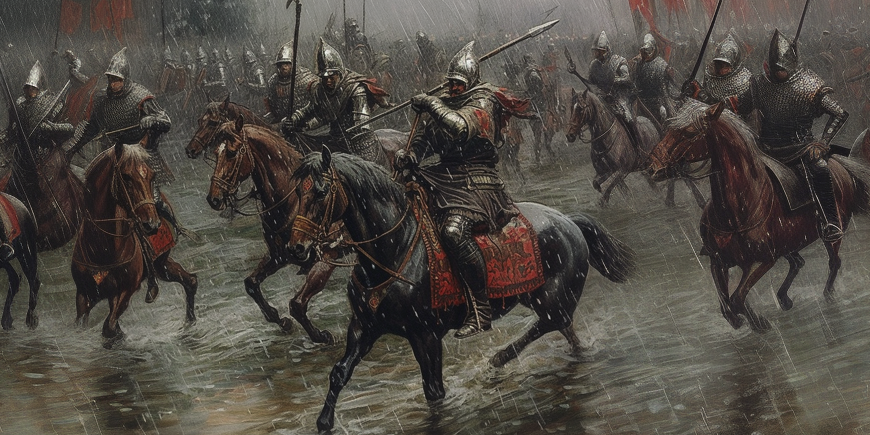
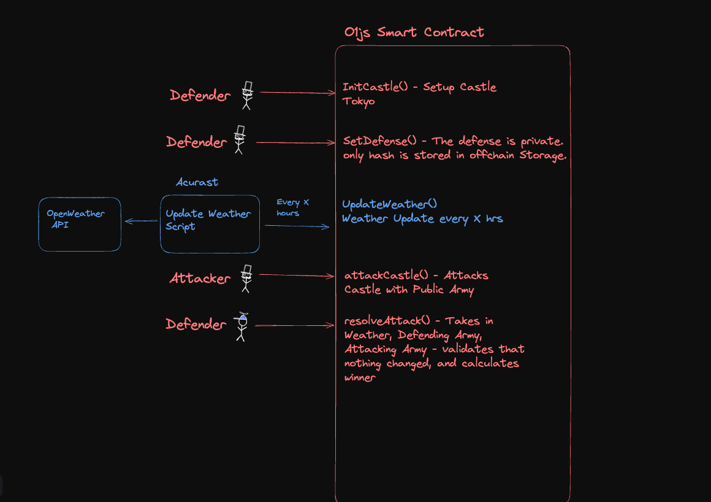

Github Links: 
Weather Oracle: https://github.com/enderNakamoto/acurast_tokyo_weather
Mina Game: https://github.com/enderNakamoto/battle_zkapp

# Tempest Tactician 

This is  Proof of Concept Game that uilizes  utilizes zero-knowledge proofs (ZKPs) implemented through O1js, a TypeScript library for zk-SNARK circuits. These ZKPs enable players to commit to strategies without revealing them, ensuring game-theoretic integrity. Crucially, we exploit O1js's new offchain storage feature, implemented through its Updatable Storage (UT) system, allowing for efficient management of large game states without compromising on-chain efficiency or security. This offchain storage solution is pivotal in handling the complex, evolving nature of player strategies and game progression.

The game's unique feature is the incorporation of real-time weather data as a decisive factor in battle outcomes. I explored Acurast, a decentralized oracle network, to fetch and integrate this data. Acurast's architecture, built on Trusted Execution Environments (TEEs), allows for the secure, confidential, and verifiable acquisition and on-chain submission of weather data. This implementation creates a trustless bridge between off-chain real-world conditions and on-chain game mechanics.

## Game Architecture

## Failed attempt at Incorporating Acurast 

One of the main contribution of the project was supposed to be incorporation of TEE Oracle for Mina Ecosystem - however, there was a problem I could not fix in time. 

For Acurast to work, I had to bundle the entire O1js interact script with it dependency and upload them to Acurast Processor using Webpack bundler. Unfortunately, this did not work in the first and second attempt. 

However, since O1js is simply typescriot, there has to be a way to do it. 

## The way forward 

Help with bundling O1js dependencies in a Acurast Processor will be really appreciated. 

Once this succeeds, I can try to integrate Keepers (decentralized cron jobs) to simulate population growth in a turn based game. 
